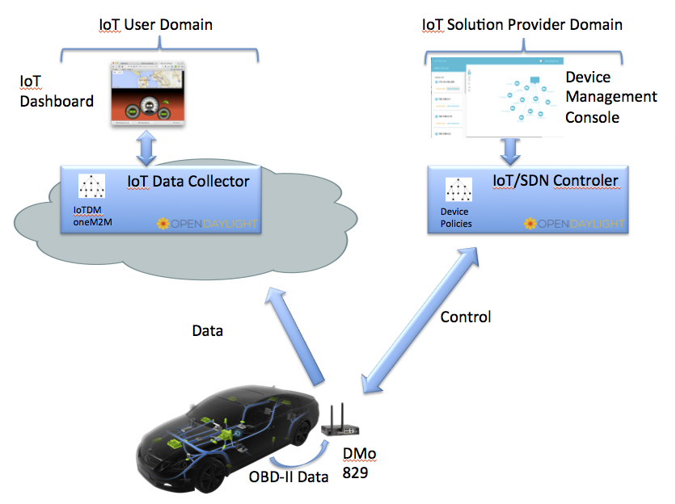
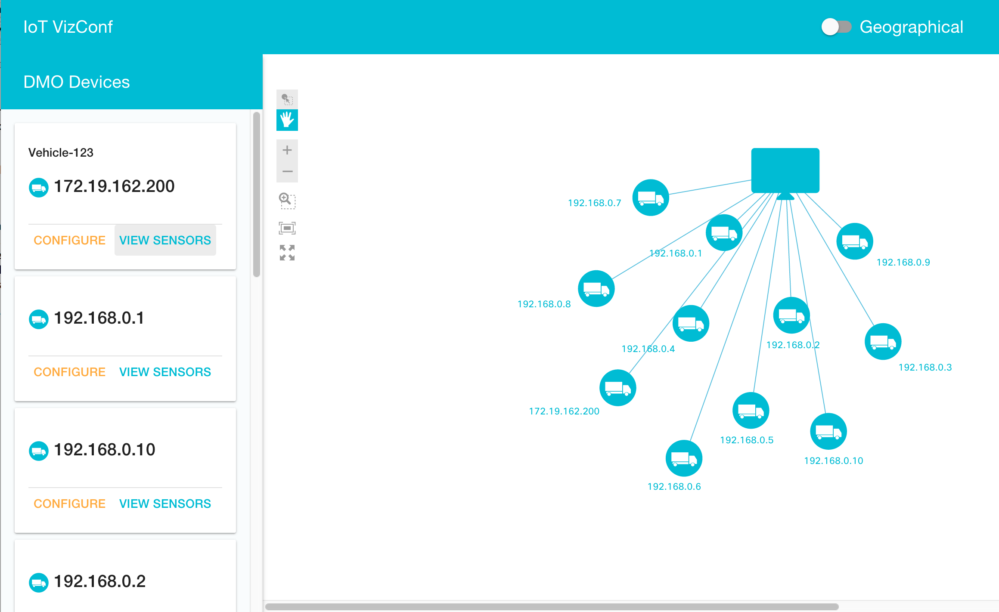
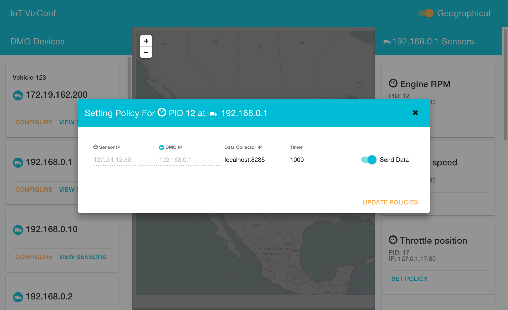

# AutoDev - IoT VizConf Application

AutoDev is a solution for managing IoT sensors on mobile vehicles. IoT VizConf (shorthand for IoT Visualization and Configuration) is an AutoDev application running on top of OpenDaylight (ODL) supporting IoT device/sensor visualization and sensor programming. More specifically is provides a web-based user interface (UI) enabling the operator to dynamically discover and render a topology of IoT devices sensors embedded in mobile vehicles. The operator can also configure IOT sensors to perform certain policy-driven actions (e.g. track and report on specific data).

This application was developed as a tool for the IoT network operator/administrator. Note that this application would be completely separate from a cloud-based application that would consume and process IoT sensor data. IoT VizConf is composed of open source components and interfaces to ODL using model-generated RESTCONF APIs.

In the example shown below, the devices are gateways running Cisco's Data In Motion (DMo) software, and the sensors are OBD-II.

## Team:

- Dave Maluf
- Chris Metz
- Herb Wildfeuer
- Lionel Florit
- Varun Seereeram
- John Burns
- Klement Sekara
- Raghuram Sudhaakar
- Musarrat Rahman
- Jan Medved

### Project demo Link:

[https://github.com/CiscoDevNet/iotvizconf](https://github.com/CiscoDevNet/iotvizconf)

### Social Tags:

IOT, Open Source, NexT, IP, SDN, IOT, DMO, RESTCONF API, YANG

### Project Kick-off Date:

September 2015

### Current Status:

Beta

## Application Overview:

The AutoDev IOT solution for this connected car/truck consists of DMO software monitoring the OBD-II, MODBUS, CANBUS sensors, an IOT controller function integrated into ODL, and a UI (IoT VizConf) enabling the administrator to configure various sensor policies. In addtion there is a cloud-based application (separate from IoT VizConf) that receives and processes sensor data.

Figure 1 depicts the architecture of the components used in this innovation.

 Figure 1 ODL DMO IOT/SDN Innovation Architecture

From the bottom-up we have a network of vehicles running Data In Motion (DMo) which monitors OBD-II sensors and based on policy configuration from the IOT/SDN controller, DMO will send  sensor data to one or more cloud applications

Inside of ODL there are YANG models of the network topology and how to configure policies. The model-driven service adaptation layer (MD-SAL) takes these models and automatically generates a set of REST APIs (referred to as RESTCONF) that applications can call. The DMO devices are modelled as nodes in the topolgy.  The sensor data is stored in the oneM2M IOT datastore.

Figure 2 shows the screen shot of the discovered device topology of the vizconf GUI.

Figure 2 AutoDev IoTVizConf Device Topology Screenshot

Figure 3 shows how a particular sensor can be configured to send its data to some application data collector in the cloud.

In summary ODL is an application platform abstracting the complexities of a network and IOT devices.  This GUI serves as an example of how to use REST interfaces to program ODL applications.

## Features:

- Developed to run on top of ODL
- Leverages RESTCONF APIs based on YANG models to model topology
- Leverages oneM2M APIs based on modelling of sensors in the oneM2M IOT data store
- Leverages the open source NeXt UI framework for topology visualization
- Source code in HTML5/CSS/Javascript, NeXt and node js

## Instructions:

- Clone repository ('git clone https://github.com/CiscoDevNet/iotvizconf.git')
- Change into directoty ('cd iotvizconf')
- Run 'npm install' inside directory
- Run 'node server.js'
- Visit 'localhost:8000' in your browser

### References

- [https://wiki.opendaylight.org/view/IoTDM:Main](https://wiki.opendaylight.org/view/IoTDM:Main)

- [https://developer.cisco.com/site/neXt/](https://developer.cisco.com/site/neXt/)

- [https://github.com/CiscoDevNet/opendaylight-sample-apps](https://github.com/CiscoDevNet/opendaylight-sample-apps)
